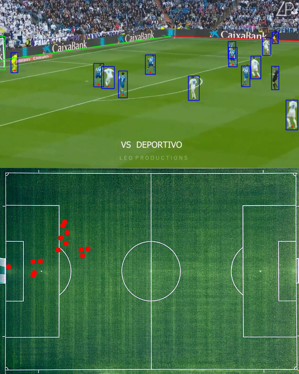
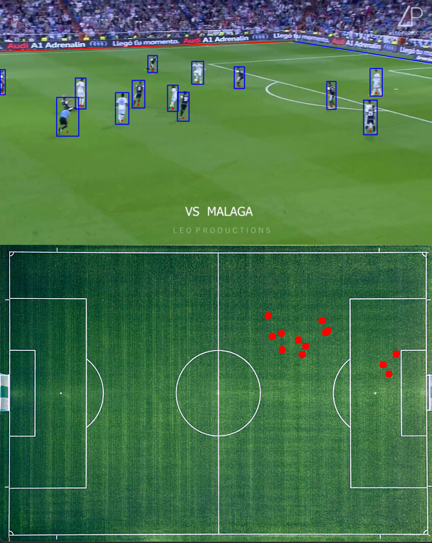

# Football-player-detection

## What it does?

The idea was to detect players from football video and convert 
it to top-down video of their coordinates on the field.

It is best explained with a result, so here are some screenshots:

The process was divided into multiple parts.

First part was to detect players on the screen and this was done using Yolov5
computer vision model. 
Secondly we needed to find where are the out lines on the
screen. Here OpenCV was very useful tool. I will not go into details, but we used
Canny edge detection for detectiong edges, Hough lines for finding straight lines
and finally using some maths, calculating which lines are most probably out lines.  
Third part was to calculate their positions on new screen.

## Requirements

Before you can run the code you need to have Yolov5 installed on your computer, 
together with python and pytorch. If you wish to run yolo on GPU I recommend you
install CUDA first. CUDA is parallel computing platform and programming model
designed exclusively for Nvidia GPU-s. With CUDA, developers are able to 
dramatically speed up computing applications by harnessing the power of GPUs.

YOLO stands for You Only Look Once. It's a computer vision architecture designed
to be fast and to be able to detect and classify objects. For our purpose it
can detect people (players) on screen and do it very well.

### Install Python and Cuda

1. Install CUDA if you have Nvidia GPU. I have cuda 11.6 installed on my computer
you can install it 
[here](https://developer.nvidia.com/cuda-11-6-0-download-archive?target_os=Windows&target_arch=x86_64&target_version=11)
It takes long to download, so be patient!
1. Install Python 3.9.13. Preferably using conda.
1. Install Torch. I have 1.13.1. IMPORTANT! If you installed cuda, you should install
it with cuda options enabled 
[here](https://pytorch.org/get-started/locally/)

### Install Yolov5

1. Open terminal on your computer and go to the folder where you wish to install 
Yolov5 repository
2. Run `git clone https://github.com/ultralytics/yolov5.git` (from [this repo](https://github.com/ultralytics/yolov5))

Very simply you now have Yolov5 installed!

Alternatively you can follow 
[this](https://wandb.ai/onlineinference/YOLO/reports/YOLOv5-Object-Detection-on-Windows-Step-By-Step-Tutorial---VmlldzoxMDQwNzk4)
tutorial. This guy explained it all very well.

## How to run

In folder tests open file `main`. Set the variable `yolov5_path` to the path
where you installed your yolov5 on computer. Then you can run the file with your
preffered python editor or run it with command line.

If you have any questions, ask!